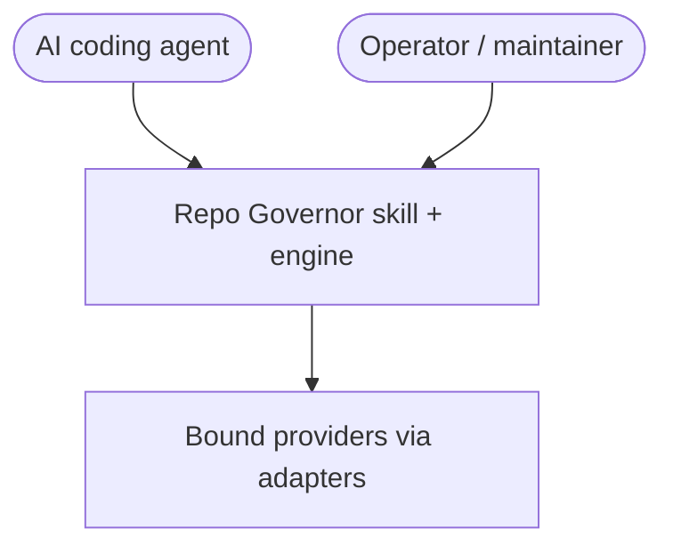
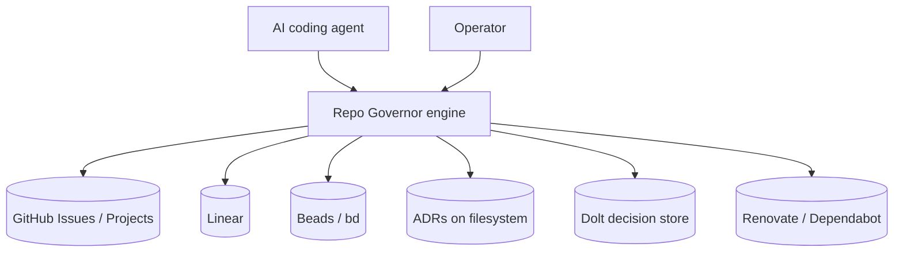
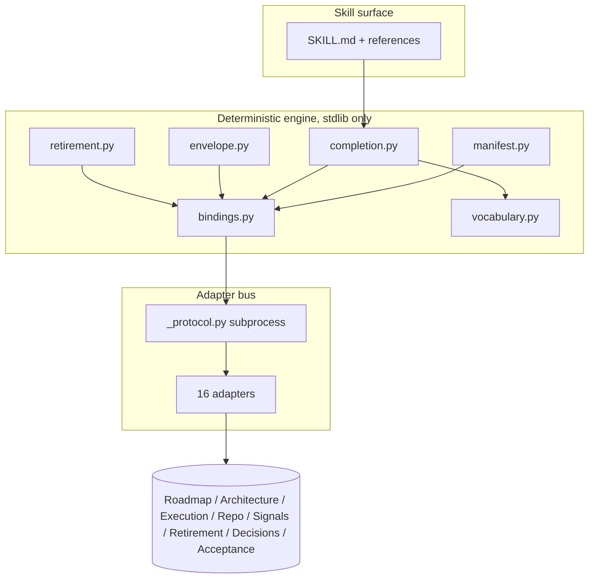
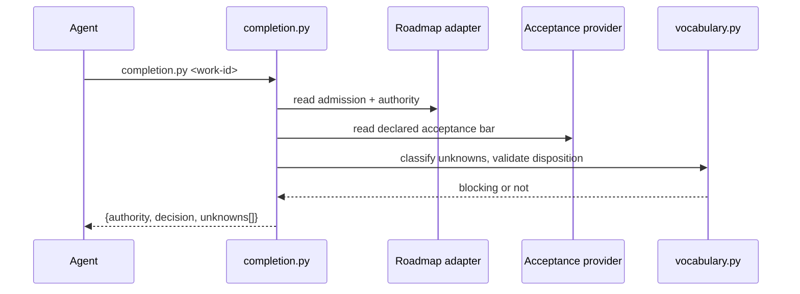
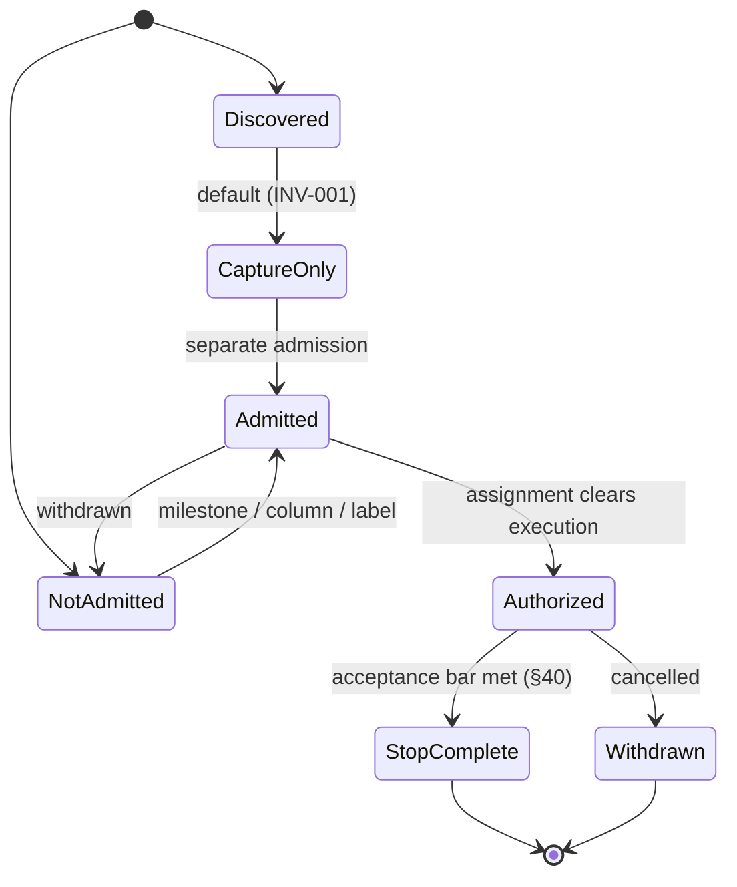
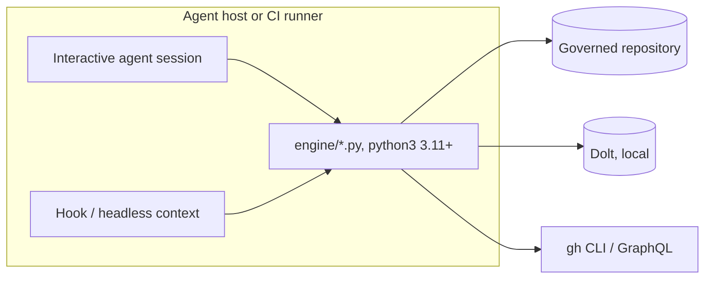
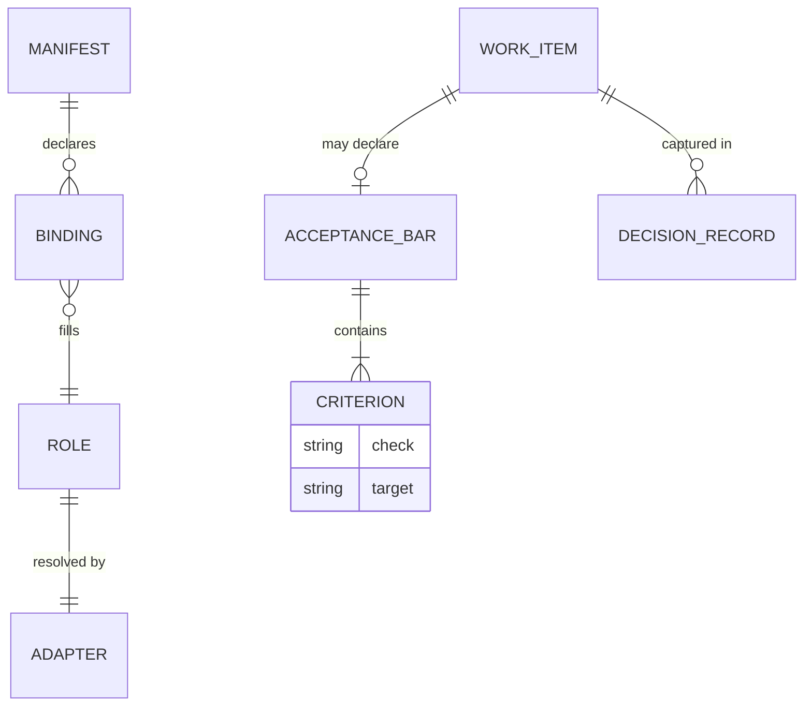
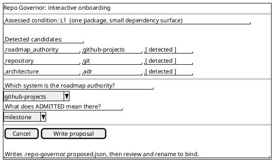

# DESIGN_DOC.md

**System:** Repo Governor
**Version:** 0.6.0
**Status:** Architecture Accepted, core thesis under validation
**Audience:** Architects, adapter authors, reviewers, technical evaluators
**Voice:** STE100
**Related requirements:** `docs/reference/product-scope.md` (PRD v0.2 extract, §1–§70), `docs/reference/invariants.md` (INV-001…INV-014)

> This document is a brownfield architecture reconstruction of the checked-out
> revision. It describes the system as built. The normative specification remains
> `docs/reference/` and the decision record remains `docs/adrs/`. Where this
> document and those disagree, those are authoritative (ADR-013).

---

## 1. Introduction and goals

Repo Governor is a tool-independent governance skill for AI-assisted software development. It determines what an AI coding agent is authorized to create, change, maintain, or retire in a repository, what the agent must capture or escalate instead, and when the agent must stop.

Repo Governor does not replace development tools. It connects to existing systems through provider interfaces, reconciles their state with a deterministic engine, and returns one bounded disposition from a closed vocabulary. It returns a verdict. It never performs the action.

The governing principle is one sentence: information may justify a decision, but information does not acquire authority merely by existing. A TODO, a task marked READY, a new dependency release, an unreferenced module, and a green build are each evidence. None is permission.

### 1.1 Quality goals

| ID | Goal | Scenario |
|----|------|----------|
| QG-1 | Determinism | The same provider state yields the same disposition on every run, because invariants are executable predicates, not prose (ADR-002). |
| QG-2 | Tool independence | One artifact governs across many agent hosts and many trackers without per-vendor code (ADR-001, ADR-003). |
| QG-3 | Auditability | Every material decision carries typed evidence and provenance through an append-only record (ADR-009). |
| QG-4 | Safety by default | No permission is inferred from an available credential. The default disposition is capture, not execute (ADR-005, INV-001). |
| QG-5 | Zero supply-chain surface | The engine uses the Python standard library only, so a tool that rules on change adds no transitive dependency tree (ADR-011). |

### 1.2 Stakeholders

| Stakeholder | Expectation |
|-------------|-------------|
| AI coding agent | A clear machine-readable verdict, and instructions on how to obey it. |
| Operator or maintainer | Confidence that an agent will not expand scope, drift the roadmap, or delete unsafely. |
| Adapter author | A single-file contract for adding a new tracker or evidence source. |
| Reviewer or evaluator | Traceability from an invariant to the code that enforces it. |



---

## 2. Constraints

- Business: solo-maintained public open-source project under Tosin Open Source. No hosted service is planned. A hosted SaaS is an explicit non-goal (§8).
- Technical: the engine is Python 3.11 or later, standard library only (ADR-011). Adapters may be written in any language and may carry their own dependencies. Adapters are reached over a subprocess protocol (ADR-003).
- Technical: the engine never calls a network service or an MCP server directly. Remote data arrives through an adapter, or through an agent that supplies the payload in the environment (ADR-016, ADR-020).
- Legal: Apache License 2.0, chosen for its patent grant and explicit contribution terms, because the adapter protocol invites third-party adapters. `LICENSE` and `NOTICE` must travel with every install (Apache-2.0 sections 4a and 4d).
- Delivery: the product ships as an Agent Skill, an open standard, installed into a host skills directory. There is no installer service and no registry dependency (ADR-001).

---

## 3. Context and scope

Repo Governor sits between an AI coding agent and the systems that hold repository truth. The agent asks a governance question. The engine reconciles state from bound providers and returns a disposition. The systems of record stay where they are, and Repo Governor writes to none of them.

**In scope:** authority resolution, scope-envelope compilation, architecture-evidence reconciliation, execution-state inspection, retirement-obligation checks, decision history, completion firewall, repository onboarding.

**Out of scope:** project management, roadmap storage, issue tracking, execution tracking, specification authoring, dependency updating, CI or CD, static analysis, code generation, and any runtime enforcement point. Repo Governor reuses these systems rather than rebuilding them (§8).



The boundary is strict in one direction. Arrows into providers are reads. No arrow is a write, because Repo Governor does not own provider state (ADR-022).

---

## 4. Solution strategy

The design rests on a small number of decisions that drive everything else. Each is recorded as an ADR.

- ADR-001: ship as an Agent Skill, the tool-independent delivery surface.
- ADR-002: a deterministic policy engine, separate from model judgment.
- ADR-003: eight provider roles with normalized contracts, reached over a subprocess protocol.
- ADR-004: a governance manifest is the sole artifact that binds providers to roles.
- ADR-005: deny by default. No permission is inferred from a reachable credential.
- ADR-007: a closed disposition vocabulary, with UNKNOWN as a valid terminal answer.
- ADR-011: standard-library-only engine, language-agnostic adapters.
- ADR-012: provider content is untrusted input. Issue bodies and roadmap text become typed facts and cited evidence, never instructions.
- ADR-016: MCP is a transport for an adapter, not a replacement for one. The engine never calls MCP.
- ADR-022: Repo Governor does not own roadmap state.
- ADR-023: the completion firewall. Once acceptance conditions are met, nothing converts to execution.
- ADR-027: the governed repository is not the install directory.

---

## 5. Building block view

The system has four layers: the agent-facing skill surface, the engine, the adapter bus, and the providers behind it.

| Building block | Responsibility | Requirements |
|----------------|----------------|--------------|
| `SKILL.md` and `references/` | Teach the agent what to run and how to obey the verdict. Progressive disclosure keeps the body small. | FR-01, FR-16 |
| `engine/bindings.py` | Resolve providers from the manifest and enforce the permission chokepoint (ADR-021, ADR-005). | FR-12, FR-13 |
| `engine/manifest.py` | Load and validate the governance manifest. Its value is what it rejects. | FR-01 |
| `engine/completion.py` | Compose STOP_COMPLETE from roadmap authority, declared acceptance, and repository evidence (§40). | FR-01, FR-10 |
| `engine/envelope.py` | Compile the ScopeEnvelope and rule on discoveries against it (§31, ADR-024). | FR-02, FR-06 |
| `engine/retirement.py` | Reconcile removal obligations across every bound provider (§18). | FR-08 |
| `engine/onboard.py` | Assess repository condition, detect candidate providers, propose a binding. Read only by default. | FR-16 |
| `engine/acceptance.py` | Show or scaffold the completion bar for one authority id. | FR-10 |
| `engine/vocabulary.py` | Hold the closed vocabularies and classify unknown reasons as blocking or not (ADR-007). | FR-15 |
| `adapters/_protocol.py` | Define the subprocess contract every adapter satisfies. | FR-12 |
| `adapters/*` | Sixteen provider adapters, one file or directory each, any language. | FR-12 |
| `conformance/*` | Nineteen suites that assert the behavior above against fixtures. | NFR-002 |



### 5.1 Directory tree

```text
repo-governor/
  SKILL.md              agent entry point, name + description + body
  AGENTS.md             always-on activation file for this repo
  .repo-governor.json   this repo governing itself (manifest)
  engine/               deterministic policy engine, stdlib only
  adapters/             16 provider adapters + _protocol.py
  conformance/          19 suites + fixtures/
  schemas/              manifest-v1.json, acceptance-v1.json
  policies/             profile definitions (lite, standard, full, ...)
  references/           tiered reference material for the skill
  docs/
    adrs/               31 ADRs + index + ratification reviews
    reference/          normative spec, §1–§70, INV-001…INV-014
    workflows/          per-situation recipes
    research/           landscape and activation research (not shipped)
  tools/                install-skill.sh, onboard-interactive.py, selftest.py, ...
  .github/workflows/    release.yml, conformance.yml, conformance-live.yml
```

---

## 6. Runtime view

### 6.1 Ask whether work is complete

The agent runs one command. The engine composes the answer from three providers and returns typed JSON. Five participants or fewer.



The decision is one of twelve values. `CONTINUE` means authorized and unfinished. `STOP_COMPLETE` means the bar is met, so the agent stops and captures discoveries. `NO_EXECUTION_AUTHORITY` means admitted but not cleared to execute. `AUTHORITY_WITHDRAWN` means cancelled, even if a task tracker still says READY. `UNKNOWN` carries a typed reason and a resolution path.

### 6.2 Authority lifecycle

The domain has a lifecycle. A work item moves through admission, then execution clearance, then completion. Discovery and withdrawal are separate edges.



Completion does not retract authority. Finished work stays authorized. A `STOP_COMPLETE` tells the agent the authorization is exhausted, not that it never existed (§40).

---

## 7. Deployment view

Repo Governor runs as code inside the agent host. There is no server and no network endpoint. The same engine runs in two places, and both govern the repository the caller stands in, not the directory the engine lives in (ADR-027).



Runtime notes. The engine is invoked by full path against a target repository. The interactive session computes the verdict. A hook can deliver the requirement to run the engine, but a hook in a headless context cannot see the agent's MCP session, so it reports `PROVIDER_UNAVAILABLE` rather than a false verdict. Secrets are never required to reach a disposition. When a role needs a credential, deny-by-default means the manifest must grant it explicitly.

The release job in `.github/workflows/release.yml` builds the published tarball by running `tools/install-skill.sh` at the tag, so a `--branch` install and the release artifact are the same bytes by construction.

---

## 8. Crosscutting concepts

- Authentication and authorization: deny by default (ADR-005). A provider absent from the manifest has no governance role, however reachable it is (INV-013, INV-014). Every bound role gets read, nothing gets write.
- Untrusted input: all provider content is data, never instruction (ADR-012). Roadmap text and issue bodies become typed facts and cited evidence.
- Error handling: adapters return typed errors, not free text (`PROVIDER_UNAVAILABLE`, `NOT_FOUND`, `UNSUPPORTED_FUNCTION`, `MALFORMED_SOURCE`, `BAD_REQUEST`). The engine prefers a typed `UNKNOWN` with a resolution over a guess (INV-012).
- Configuration: one manifest, `.repo-governor.json`, is the sole binding artifact (ADR-004). JSON is the canonical format (ADR-015). Binding is a human act recorded in a commit (ADR-010).
- Extensibility: a new tracker or evidence source is a single adapter file that satisfies `adapters/_protocol.py`. The engine holds no adapter knowledge and does not change to accept one (ADR-003, asserted by `conformance/bindings.py`).
- Provenance: material decisions are recorded append-only (ADR-009), stored through a decision-history provider that can be a file, a GitHub-backed log, or a Dolt database.

The core domain schema, as bound in a manifest and its supporting files:



---

## 9. Architectural decisions

The full record is `docs/adrs/`. Three decisions carry most of the design weight.

### ADR-001: Agent Skill as the primary delivery surface

**Status:** Accepted
**Context:** the product thesis is tool independence. A vendor-specific integration would contradict it.
**Decision:** ship as an Agent Skill, an open standard adopted by many agent hosts. Install by placing a directory where the host looks for skills.
**Consequences:** one artifact runs across hosts with no per-vendor code. The skill body must stay small, so detail moves to tiered reference files. Activation depends on the host, which introduces a measurement problem addressed by `tools/selftest.py`.
**Alternatives:** an MCP server (rejected as a vendor and transport bet); a CLI package on a language registry (rejected as it fragments delivery per ecosystem).

### ADR-002: Deterministic policy engine separate from model judgment

**Status:** Accepted
**Context:** an agent that reasons past a prose rule is a documented failure mode. Rules stated as prompt text can be argued away.
**Decision:** encode invariants as executable predicates in a deterministic engine. Same inputs, same disposition, always.
**Consequences:** dispositions are testable and reproducible. Model judgment is confined to discovery and description, not authorization.
**Alternatives:** a model-graded rubric (rejected; not reproducible, not auditable).

### ADR-023: The completion firewall

**Status:** Accepted
**Context:** work rarely ends with nothing left over, and the leftovers feel like momentum. Continuing past done is the specific failure the product exists to prevent.
**Decision:** once acceptance conditions are met, nothing converts to execution, not a bug, not a necessary change, not a three-line fix (§40).
**Consequences:** the firewall is invisible when it works and looks like lost momentum until the one time it was not. Criteria may not be loosened silently; amendments carry a citation and are reported separately.
**Alternatives:** allow small follow-ups after completion (rejected; that is the failure being prevented).

---

## 10. Quality requirements

| ID | Requirement | Risk | Verify |
|----|-------------|------|--------|
| NFR-001 | The engine shall return the same disposition for the same provider state on every run. | High | `conformance/layer1.py`, `conformance/vocabulary.py` |
| NFR-002 | Every conformance suite shall report how much it asserted, so a suite that stops asserting cannot look green. | High | `conformance/coverage.py` |
| NFR-003 | The engine shall depend on the Python standard library only. | Medium | `conformance/imports.py` |
| NFR-004 | Two providers of the same role shall produce equivalent dispositions from equivalent state. | High | `conformance/layer2.py` (the thesis test) |
| NFR-005 | No permission shall be granted that the manifest did not declare. | High | `conformance/bindings.py` |
| NFR-006 | An empty completion bar shall never read as satisfied. | High | `conformance/acceptance.py` |
| NFR-007 | An agent transport shall produce byte-identical results to a direct adapter call. | Medium | `conformance/transport.py` |

---

## 11. Risks and technical debt

- Core thesis unproven on live pairs. Layer 2 equivalence has run on recorded fixtures, not two live providers. The one live pairing is a Dolt decision store against a GitHub fixture. Owner: maintainer. Mitigation: issue #1, tracked as a standing thesis risk.
- Envelope thinness. Most trackers lack explicit non-goals, so a compiled scope envelope is often thin, and a thin envelope governs weakly. Mitigation: issue #2, measured across six repositories.
- Activation is model-mediated. A skill can be installed and never fire. Measured at 20 of 20 on one host and 0 of 2 on another. Mitigation: `tools/selftest.py`, an `AGENTS.md`, and community measurement requests (milestone RG-VALIDATION-v0.2, issues #5 and #42).
- Distribution is near zero. The artifact is high quality and effectively invisible, with no registry or directory presence. Mitigation: milestone RG-DISTRIBUTION-v0.7 (issues #233, #234, #235) and ADR-034.
- Unverified hook surfaces. Five hook templates ship and one is verified. An unverified hook can look identical to a hook that does nothing. Mitigation: per-host issues #47 through #50, and a delivery-token check.
- Two Proposed ADRs the runtime already depends on (031 and 033), recorded as a departure in the ratification reviews. Owner: maintainer.

---

## 12. Glossary

| Term | Meaning |
|------|---------|
| ADR | Architecture Decision Record. A dated record of one decision, its context, and its consequences. |
| Admission | The declared signal that a work item is wanted, for example membership of a milestone. Admission is not authority to execute. |
| Adapter | A single-file program that satisfies `adapters/_protocol.py` and normalizes one provider into a role contract. |
| Agent Skill | An open packaging standard: a `SKILL.md` with frontmatter plus supporting files, discovered by an agent host. |
| Disposition | One of twelve closed verdicts the engine can return. |
| Manifest | `.repo-governor.json`. The sole artifact that binds providers to roles. |
| MCP | Model Context Protocol. A transport an agent host can use to reach a remote provider. The engine never calls it directly (ADR-016). |
| PRD | Product Requirements Document. The source, v0.2, from which `docs/reference/product-scope.md` is extracted. |
| Provider role | One of eight questions the engine asks, such as roadmap authority or retirement evidence. |
| ScopeEnvelope | The compiled boundary of authorized work, against which a discovery is ruled. |
| STOP_COMPLETE | The disposition that says acceptance conditions are met and the agent must stop. |
| UNKNOWN | A valid terminal disposition carrying a typed reason and a resolution path. |
| Provider | A system of record Repo Governor reads through an adapter, such as GitHub, Linear, Beads, or the filesystem. |
| Governed repository | The repository the caller stands in, which the engine governs, distinct from the install directory (ADR-027). |

### Closed disposition vocabulary (from `engine/vocabulary.py`)

- Execution: `EXECUTE`, `CONTINUE`, `STOP_COMPLETE`
- Review: `CAPTURE_ONLY`, `ROADMAP_REVIEW`, `ARCHITECTURE_REVIEW`, `MAINTENANCE_REVIEW`, `RETIREMENT_REVIEW`
- Refusal: `NO_EXECUTION_AUTHORITY`, `AUTHORITY_WITHDRAWN`, `CONFLICT`, `UNKNOWN`

### The fourteen invariants (from `docs/reference/invariants.md`)

INV-001 discovery confers no authority. INV-002 execution state confers no roadmap authority. INV-003 repository evidence is not product intent. INV-004 architecture constrains, does not authorize. INV-005 persistence confers no authority. INV-006 external change is a signal, not work. INV-007 apparent obsolescence confers no deletion authority. INV-008 superseded decisions do not constrain. INV-009 completed scope means stop. INV-010 no illegal transitions. INV-011 empty repository is not unlimited authority. INV-012 UNKNOWN is valid. INV-013 detection is not provider authority. INV-014 capability is not permission.

---

## Appendix: user-facing surfaces

Repo Governor has no graphical user interface. Its user-facing surfaces are the command line, the JSON verdict an operator or agent reads, and one interactive terminal session for onboarding. The interactive onboarding session is the single interactive screen, drawn below as a PlantUML Salt wireframe. The source is `docs/diagrams/onboarding-wireframe.puml`. Render it with `plantuml -tpng docs/diagrams/onboarding-wireframe.puml`.


