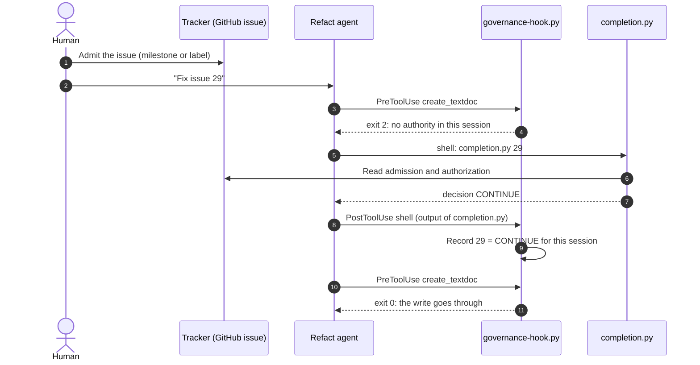
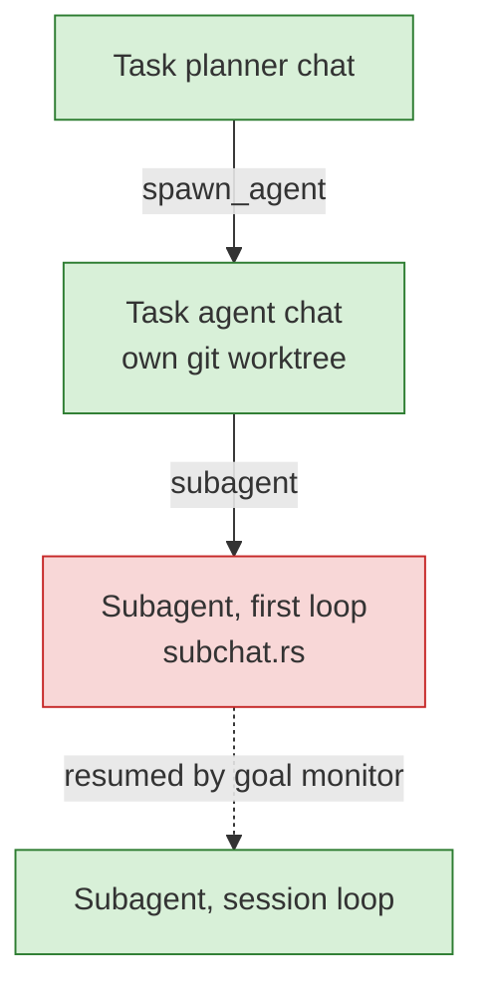

# Runbook: Govern a repository's Refact agent with Repo Governor

**Owner**: Repo Governor maintainer ([tosin2013](https://github.com/tosin2013))
**Risk level**: Medium. A wrong setup looks governed and is not.
**Last updated**: 2026-09-26
**Last tested**: 2026-09-26, Refact 8.6.4, on a clone of `tosin2013/local-knowledge-vault`
**Version**: 1.0.0
**Tracks**: [issue 247](https://github.com/tosin2013/repo-governor/issues/247) (the integration), [issue 254](https://github.com/tosin2013/repo-governor/issues/254) and [issue 248](https://github.com/tosin2013/repo-governor/issues/248) (open gaps)

---

## Quick reference

| Attribute | Value |
|---|---|
| **Execution time** | About 15 minutes for one repository |
| **Impact window** | None. Only new Refact chats in the repository are affected. |
| **Rollback time** | About 2 minutes |
| **Prerequisites** | An onboarded repository, Refact 8.6.4 or later with a working model, Python 3 |

---

## Support status

Read this table before you use the integration. It states what is tested and what is not safe yet.

| Use of Refact | Status | Reason |
|---|---|---|
| Agent mode, a person at the keyboard | **Supported. Tested on a real host.** | Writes without authority are blocked. Writes under `CONTINUE` go through. |
| Task planner, fleets, or subagents | **Not supported yet** | A subagent runs tools with no `PreToolUse` hook ([JegernOUTT/refact#35](https://github.com/JegernOUTT/refact/issues/35)). A blocked agent can delegate around the block ([issue 254](https://github.com/tosin2013/repo-governor/issues/254)). |
| Any use with no person watching | **Not supported yet** | An agent can change the admission signal with `gh` and admit its own work ([issue 248](https://github.com/tosin2013/repo-governor/issues/248)). |
| File changes made with a shell command | **Not gated, on any host** | The write gate checks file tools only. `sed -i` or `echo >` through `shell` is not checked. |

---

## Scope and use case

### When to use this runbook

- You want Refact's agent to work in a repository that Repo Governor governs.
- A Refact agent edits files in a governed repository and nothing stops it.
- A Refact agent is blocked and you do not know why.
- You want to remove the integration from a repository.

### Expected outcome

Refact's agent cannot change a file in the repository until it runs `completion.py <authority-id>` in the same chat and the engine returns `CONTINUE`. A refusal, or no authority at all, blocks the write. The agent gets the reason as the tool result.

### What this runbook does not cover

- Installing Refact or choosing a model. See the [Refact wiki](https://github.com/JegernOUTT/refact/wiki).
- Onboarding a repository to Repo Governor. See [installation.md](../installation.md).
- Reading Refact's task board or knowledge notes as evidence. [Issue 251](https://github.com/tosin2013/repo-governor/issues/251) and [issue 252](https://github.com/tosin2013/repo-governor/issues/252) track this work.

---

## How the integration works

### Who does what

| Part | Role |
|---|---|
| **Refact** | The host. It runs the agent and calls the hook before and after each tool call. |
| **`governance-hook.py`** | The shared hook script. It never decides authorization. It reports what the engine decided. |
| **`engine/completion.py`** | The only thing that decides. It reads the providers in `.repo-governor.json` and returns a disposition. |
| **Your tracker** | The roadmap of record. A person admits work there, with the milestone or label that the manifest declares. |
| **`AGENTS.md`** | The standing instruction. Refact loads it into every chat. It is the only way to tell the agent about governance before it acts. |

### The loop in one chat



### What the hook does at each event

| Refact event | Tools matched | Hook moment | Result |
|---|---|---|---|
| `PreToolUse` | `apply_patch`, `create_textdoc`, `update_textdoc*`, `undo_textdoc`, `mv`, `rm`, `worktree_merge`, `merge_agent`, `merge_ready_in_order` | `write` | Exit 2 blocks the tool. Refact returns the reason to the agent. |
| `PostToolUse` | `shell` | `capture` | Records the disposition from a `completion.py` run for this chat. |
| `UserPromptSubmit` | Not installed | None | Refact discards hook output for this event. `AGENTS.md` does this job instead. |

### What each disposition does to a write

| Disposition from `completion.py` | Write in blocking mode |
|---|---|
| No `completion.py` run in this chat | Blocked. The message tells the agent to run the engine. |
| `CONTINUE` | Allowed |
| `NO_EXECUTION_AUTHORITY`, `AUTHORITY_WITHDRAWN`, `CONFLICT`, `UNKNOWN` | Blocked. The message names the disposition. |
| `STOP_COMPLETE` | Blocked. The authorization is used up (ADR-023). New work needs new authority. |

The hook records a verdict for each chat in `.repo-governor/sessions/<chat-id>.json`. A new chat starts with no authority.

### Why only blocking mode works on Refact

Refact reads only the exit code of a hook. Exit 2 blocks the tool. Refact discards everything the hook writes to standard output. Advisory mode speaks through standard output, so on Refact advisory mode does nothing. The Refact template always passes `--exit2-on-deny`. The manifest setting `repo_governor.enforcement` still decides: `"blocking"` blocks, and anything else is silent.

### Fleets and subagents (read before you use the planner)



Green chats go through the hook. The red chat does not ([JegernOUTT/refact#35](https://github.com/JegernOUTT/refact/issues/35)). In the test on 2026-09-26, a blocked task agent delegated to a subagent in the same turn, and the subagent's first two edits went through. The card instructions also dropped the issue number. No agent knew which authority to give to `completion.py`. Do not run the planner in a governed repository until [issue 254](https://github.com/tosin2013/repo-governor/issues/254) is closed.

---

## Prerequisites

### Required access

- [ ] Write access to the repository, to commit the manifest and `AGENTS.md`.
- [ ] Read access to the tracker that the manifest binds. For GitHub, `gh auth status` succeeds.
- [ ] Write access to `~/.config/refact/privacy.yaml`.

### Required tools

- [ ] Refact 8.6.4 or later, with a chat model that works in agent mode.
- [ ] Python 3.9 or later.
- [ ] Git.
- [ ] A local clone of Repo Governor. This runbook calls its path `$RG_SRC`.

**Verify the tools**:

```bash
~/.refact/bin/refact version
python3 --version
git --version
gh auth status
```

### System state

- [ ] The repository has a `.repo-governor.json`. If it does not, onboard it first ([installation.md](../installation.md)).
- [ ] The repository has an `AGENTS.md` that says the repository is governed and how to run the engine.

---

## Pre-flight checks

**STOP**: Do not continue until all checks pass.

### Check 1: Refact runs

```bash
~/.refact/bin/refact doctor
```

✅ **Pass criteria**: `daemon reachable` and `version match` show a check mark.
❌ **Fail action**: Fix Refact first. This runbook cannot work without a running daemon.

### Check 2: The manifest is valid

```bash
cd /path/to/your/repo
python3 "$RG_SRC/engine/manifest.py" --validate
```

✅ **Pass criteria**: The last line starts with `READY_FOR_GOVERNANCE`.
❌ **Fail action**: Read each `[FINDING]` line and fix it. `CONDITION_BELOW_FLOOR` means the declared level is lower than the repository's floor (ADR-006).

### Check 3: The manifest is committed

```bash
git ls-files --error-unmatch .repo-governor.json
```

✅ **Pass criteria**: The command prints `.repo-governor.json`.
❌ **Fail action**: Do Step 2 of the procedure. An untracked manifest governs one machine only. A fresh clone, a CI job, or another developer sees no governance.

---

## Step-by-step procedure

### Step 1: Set blocking mode

**What this does**: Lets the hook refuse a write. On Refact, advisory mode does nothing.

1. Open `.repo-governor.json`.
2. Set `"enforcement": "blocking"` in the `repo_governor` object.

```json
"repo_governor": {
  "version": 1,
  "engine_min_version": "0.1.0",
  "enforcement": "blocking"
}
```

**Verification**:

```bash
python3 -c "import json;print(json.load(open('.repo-governor.json'))['repo_governor'].get('enforcement'))"
```

✅ **Success indicator**: The command prints `blocking`.

---

### Step 2: Commit the governance files

**What this does**: Puts the manifest and `AGENTS.md` where every clone and every worktree can see them.

```bash
git add .repo-governor.json AGENTS.md
git commit -m "Govern this repository with Repo Governor"
```

**Verification**:

```bash
git ls-files .repo-governor.json AGENTS.md
```

✅ **Success indicator**: Both paths print.

---

### Step 3: Install the skill and the Refact hook

**What this does**: Copies Repo Governor into `.refact/skills/repo-governor` and writes `.refact/hooks.yaml` from `tools/hooks/refact.json`.

```bash
bash "$RG_SRC/tools/install-skill.sh" "$PWD" .refact/skills yes
```

**Expected output** (excerpt):

```text
  hook installed -> /path/to/your/repo/.refact/hooks.yaml
  REFACT: verified from its source, not yet on a running host (issue 247).
  Project hooks run ONLY when this repository is listed in
  hooks.trusted_projects in ~/.config/refact/privacy.yaml:
```

**Verification**:

```bash
python3 -c "import json;d=json.load(open('.refact/hooks.yaml'));print(sorted(d['hooks']))"
```

✅ **Success indicator**: The command prints `['PostToolUse', 'PreToolUse']`.
⚠️ **If failed**: If the installer says `NOT installed: ... is not JSON`, your `.refact/hooks.yaml` is hand-written YAML. Copy the two entries from `$RG_SRC/tools/hooks/refact.json` into it by hand. Replace `RG_SKILL_DIR` with the absolute path of `.refact/skills/repo-governor`.

---

### Step 4: Trust the repository in Refact

**What this does**: Lets Refact run the project hooks. Refact does not run project hooks for a project that is not trusted.

1. Get the absolute path of the repository:

   ```bash
   pwd -P
   ```

2. Open `~/.config/refact/privacy.yaml`.
3. Add the path to `hooks.trusted_projects`:

   ```yaml
   hooks:
     trusted_projects: ["/absolute/path/to/your/repo"]
   ```

4. Restart the Refact worker for the repository:

   ```bash
   ~/.refact/bin/refact restart "$PWD"
   ```

✅ **Success indicator**: The restart command prints `restarted`.
⚠️ **Important**: Refact reads this file at startup. A worker that started before the change does not run the hooks.

---

### Step 5: Verify the hook without Refact

**What this does**: Sends the hook the same input that Refact sends. Each check takes a few seconds.

**Check A: a write with no authority is blocked.**

```bash
printf '{"hook_event_name":"PreToolUse","session_id":"rg-runbook-check","project_dir":"%s","tool_name":"create_textdoc","tool_input":{}}' "$PWD" \
  | python3 .refact/skills/repo-governor/tools/hooks/governance-hook.py write --exit2-on-deny >/dev/null
echo "exit=$?"
```

**Expected output**:

```text
No authority has been established in this session. A write without a named authority has nothing behind it (INV-015: write capability is not authority to choose a transition). Run: python3 /path/to/your/repo/.refact/skills/repo-governor/engine/completion.py <authority-id>
exit=2
```

✅ **Success indicator**: `exit=2`.
❌ **If `exit=0` and no message**: The hook did not find a governed manifest in blocking mode. Go to [Edits go through with no block](#edits-go-through-with-no-block).

**Check B: an authorized issue lets the write through.** Replace `29` with an issue that your tracker admits and authorizes.

```bash
ID=29
OUT=$(python3 .refact/skills/repo-governor/engine/completion.py "$ID")
python3 - "$PWD" "$ID" "$OUT" <<'EOF'
import json, subprocess, sys
repo, aid, out = sys.argv[1:4]
payload = {"hook_event_name": "PostToolUse", "session_id": "rg-runbook-check",
           "project_dir": repo, "tool_name": "shell",
           "tool_input": {"command": f"python3 .refact/skills/repo-governor/engine/completion.py {aid}"},
           "tool_output": out}
subprocess.run(["python3", repo + "/.refact/skills/repo-governor/tools/hooks/governance-hook.py", "capture"],
               input=json.dumps(payload), text=True)
EOF
cat .repo-governor/sessions/rg-runbook-check.json
printf '{"hook_event_name":"PreToolUse","session_id":"rg-runbook-check","project_dir":"%s","tool_name":"create_textdoc","tool_input":{}}' "$PWD" \
  | python3 .refact/skills/repo-governor/tools/hooks/governance-hook.py write --exit2-on-deny
echo "exit=$?"
```

**Expected output**:

```text
{
  "authority_id": "29",
  "disposition": "CONTINUE"
}
exit=0
```

✅ **Success indicator**: The disposition is `CONTINUE` and `exit=0`.
⚠️ **If the disposition is not `CONTINUE`**: The issue is not authorized. Admit and authorize it in the tracker, or use a different issue.

**Remove the test session**:

```bash
rm -f .repo-governor/sessions/rg-runbook-check.json
```

---

### Step 6: Verify in Refact

**What this does**: Shows that a real Refact chat is blocked, and that the block reaches the agent.

```bash
~/.refact/bin/refact run --project "$PWD" --approve auto --timeout-secs 300 \
  "Use create_textdoc to create RG-CHECK.md containing one line: check. Do not run shell commands."
~/.refact/bin/refact logs "$PWD" | grep hooks_runner | tail -3
ls RG-CHECK.md
```

**Expected output** (excerpt):

```text
hooks_runner: hook blocked action: No authority has been established in this session. ...
ls: RG-CHECK.md: No such file or directory
```

✅ **Success indicator**: The log shows `hook blocked action` and `RG-CHECK.md` does not exist.
⚠️ **Note**: `refact run` can return before the chat stops. Wait 30 seconds before you run `ls`.

---

### Step 7: Work an issue (daily use)

**What this does**: Gives the agent an authority it can prove.

1. In the tracker, a person admits the issue. Use the admission signal that the manifest declares.
2. If the manifest declares a separate authorization signal, a person also sets it. An example is an assignee.
3. In Refact, name the issue number in the first message: "Work on issue 29."
4. Let the agent run `completion.py 29` before it edits. The hook message tells it to do this.
5. Start a new chat for a different issue. The authority belongs to one chat.

**Do not** let the agent admit or authorize work. If the agent offers to add a label, a milestone, or an assignee, refuse. Until [issue 248](https://github.com/tosin2013/repo-governor/issues/248) is closed, nothing technical stops it.

---

## Verification and success criteria

- [ ] `manifest.py --validate` ends with `READY_FOR_GOVERNANCE`, with no `MANIFEST_UNTRACKED` finding.
- [ ] `.refact/hooks.yaml` has `PreToolUse` and `PostToolUse`.
- [ ] The repository path is in `hooks.trusted_projects`.
- [ ] Step 5 Check A prints `exit=2`.
- [ ] Step 5 Check B prints `CONTINUE` and `exit=0`.
- [ ] Step 6 shows `hook blocked action` in the worker log.

---

## Rollback procedure

### When to roll back

- The hook blocks work that the tracker authorizes, and [Troubleshooting](#troubleshooting) does not fix it.
- You stop using Refact in the repository.

### Rollback steps

#### Step 1: Remove the hook entries

Remove the `PreToolUse` and `PostToolUse` entries that call `governance-hook.py` from `.refact/hooks.yaml`. If Repo Governor wrote the file and you added nothing to it, delete it:

```bash
rm .refact/hooks.yaml
```

#### Step 2: Remove the trust entry

Remove the repository path from `hooks.trusted_projects` in `~/.config/refact/privacy.yaml`.

#### Step 3: Restart the worker

```bash
~/.refact/bin/refact restart "$PWD"
```

#### Step 4: Verify the rollback

Run Step 6 again. The file is created and the log shows no `hook blocked action`.

The manifest, `AGENTS.md`, and other hosts (Claude Code, Codex, Cursor) do not change. Governance for those hosts continues.

---

## Troubleshooting

### Edits go through with no block

**Symptoms**: A Refact agent changes files with no authority. The worker log shows no `hooks_runner` line.

**Diagnosis**:

```bash
grep -n "trusted_projects" ~/.config/refact/privacy.yaml
python3 -c "import json;print(json.load(open('.repo-governor.json'))['repo_governor'].get('enforcement'))"
python3 -c "import json;print(json.load(open('.refact/hooks.yaml'))['hooks']['PreToolUse'][0]['matcher'])"
```

**Causes and solutions**:

| Cause | Solution |
|---|---|
| The repository is not in `trusted_projects` | Do Step 4, then restart the worker. |
| The worker started before the trust change | `~/.refact/bin/refact restart "$PWD"` |
| `enforcement` is not `blocking` | Do Step 1. |
| The edit came from a subagent | Known gap, [JegernOUTT/refact#35](https://github.com/JegernOUTT/refact/issues/35). Do not use the planner or subagents. |
| The edit came from a shell command | Known gap on every host. The write gate checks file tools only. |
| Hooks are in `.claude/settings.json` only | Refact reads that file but drops the `args` array. Install `refact.json` as in Step 3. |

---

### Every edit is blocked, even after `completion.py`

**Symptoms**: The agent ran `completion.py` and the next edit is still blocked.

**Diagnosis**:

```bash
ls -t .repo-governor/sessions/ | head -3
cat ".repo-governor/sessions/$(ls -t .repo-governor/sessions/ | head -1)"
```

| What you see | Cause | Solution |
|---|---|---|
| No session file | The capture did not run. `completion.py` ran through a tool other than `shell`. | Ask the agent to run it with the `shell` tool. |
| `"disposition": null` | Your Repo Governor copy is older than commit `a4da03b`, which fixed capture of a quoted path. | Reinstall with Step 3 from a current checkout. |
| A disposition other than `CONTINUE` | The engine refused this authority. | Read the `unknowns` in the `completion.py` output. Admit or authorize the issue in the tracker. |
| The right file for a different chat | The authority belongs to another chat. | Run `completion.py` again in this chat. |

---

### The agent asks for an authority id, or makes one up

**Symptoms**: The agent asks "which authority id?", or runs `completion.py write` or another invented id.

**Cause**: The chat does not know which issue the work belongs to. In a fleet, the planner does not pass the issue number to its cards ([issue 254](https://github.com/tosin2013/repo-governor/issues/254)).

**Solution**: Give the issue number in the first message. An invented id gets `UNKNOWN` from the engine and stays blocked. The block is correct.

---

### The agent offers to add a label, milestone, or assignee

**Symptoms**: After a refusal, the agent proposes to change the issue in the tracker to "grant authority".

**Solution**: Refuse. Admission is a human act. Until [issue 248](https://github.com/tosin2013/repo-governor/issues/248) is closed, nothing technical stops an agent that has `gh` access.

---

### `Model '...' not found. Server has the following models: []`

**Cause**: The Refact provider has no enabled chat model. This is a Refact configuration problem, not a governance problem.

**Solution**: In `~/.config/refact/providers.d/<provider>.yaml`, list the model in `enabled_models` and in `chat_models`. Restart the worker.

---

### `timeout exceeds maximum of 3600 seconds`

**Cause**: The model asked Refact's `shell` tool for a timeout that is too long. Refact's policy refuses the call. The hook does not cause this error.

**Solution**: Tell the agent to pass `timeout 60` to the `shell` tool.

---

### Escalation path

| Problem | Where to report |
|---|---|
| The hook blocks or allows the wrong thing | [Repo Governor issues](https://github.com/tosin2013/repo-governor/issues). Attach the session file and the `hooks_runner` log lines. |
| Refact does not call the hook, or drops its result | [Refact issues](https://github.com/JegernOUTT/refact/issues). Link the report from [issue 254](https://github.com/tosin2013/repo-governor/issues/254). |
| The engine returns the wrong disposition | [Repo Governor issues](https://github.com/tosin2013/repo-governor/issues). Attach the full `completion.py` output. |

---

## Post-execution tasks

### Immediately

- [ ] Remove test files and test sessions (`RG-CHECK.md`, `.repo-governor/sessions/rg-runbook-check.json`).
- [ ] Record the Refact version you tested in your repository notes.

### When a tracked issue closes

- [ ] [JegernOUTT/refact#35](https://github.com/JegernOUTT/refact/issues/35) or [issue 254](https://github.com/tosin2013/repo-governor/issues/254): Update [Support status](#support-status) and the fleet section. Run the fleet test again first.
- [ ] [Issue 248](https://github.com/tosin2013/repo-governor/issues/248): Update the Step 7 warning and the self-admission troubleshooting entry.
- [ ] Update **Last tested** and the version history.

---

## Appendix

### Related documents

- [installation.md, Hooks section](../installation.md): host matrix and the other hosts' templates.
- [ADR-029](../adrs/029-hooks-as-deterministic-delivery-surface.md): the hook surface, with the Refact amendment.
- [ADR-018](../adrs/018-admission-signal-is-declared-not-assumed.md): the admission signal.
- [ADR-023](../adrs/023-completion-firewall.md): `STOP_COMPLETE`.
- [Workflows](../workflows/README.md): prompt recipes for each kind of work.

### Evidence

- Single-agent tests, 2026-09-26: PR [249](https://github.com/tosin2013/repo-governor/pull/249) description.
- Fleet test, 2026-09-26: [issue 254](https://github.com/tosin2013/repo-governor/issues/254).

### Version history

| Version | Date | Author | Changes |
|---|---|---|---|
| 1.0.0 | 2026-09-26 | Repo Governor maintainer, with Claude Code | First version, after the single-agent and fleet tests |

---

**Next review**: when [issue 254](https://github.com/tosin2013/repo-governor/issues/254), [issue 248](https://github.com/tosin2013/repo-governor/issues/248), or [JegernOUTT/refact#35](https://github.com/JegernOUTT/refact/issues/35) closes, or on 2026-12-26.
